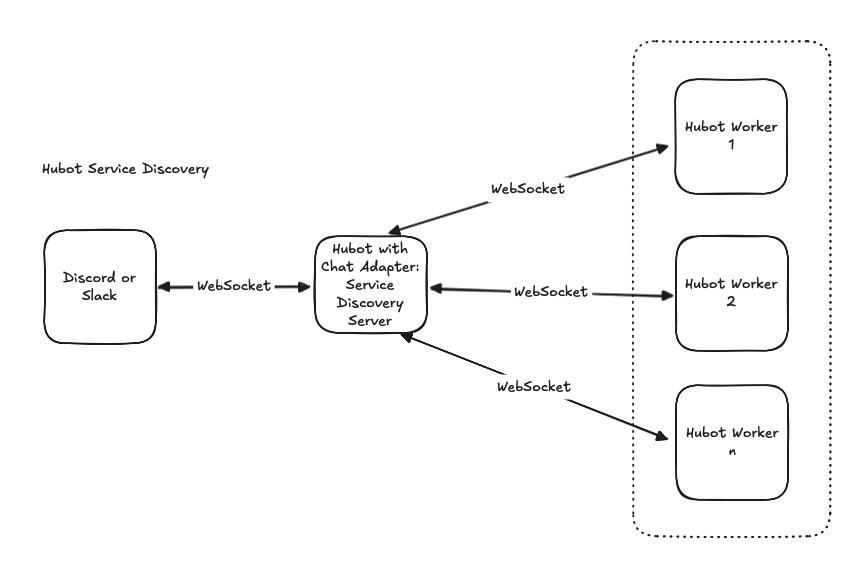

# Hubot Service Discovery

**hubot-service-discovery** is a Hubot service discovery system that lets you scale your chatbot horizontally by distributing message processing across multiple independent worker instances.

## The Problem & Solution

### Why You Might Need This

Running a single Hubot instance has limits:
- **Capacity**: As chat volume grows, a single instance becomes a bottleneck
- **Resilience**: If the instance crashes, your entire chatbot goes down
- **Flexibility**: You can't separate concerns (e.g., expensive AI processing vs. simple commands)
- **Maintenance**: Deploying new code requires restarting the bot and losing connections

### How This System Solves It

Service Discovery allows you to:

1. **Scale horizontally** - Run multiple worker instances that share the message load
2. **Isolate concerns** - Run different code in different worker groups (e.g., fast workers for simple commands, powerful workers for AI features)
3. **Zero-downtime deployments** - Update workers without interrupting the main chatbot
4. **Improve reliability** - If one worker dies, others handle its messages
5. **Optimize costs** - Use different hardware for different worker types (small instances for simple tasks, beefy instances for heavy work)

### Real-World Example

Imagine a Discord bot that:
- Answers simple questions and moderation commands (fast, simple)
- Runs AI/ML models for intelligent responses (slow, expensive)
- Processes admin tasks (critical, can't fail)

With service discovery:
- Deploy 5 fast workers for simple commands
- Deploy 2 powerful workers for AI (each with GPU)
- Deploy 1 critical worker for admin tasks
- The main bot routes each message to appropriate workers based on group

If an AI worker crashes, simple commands still work. If you need more capacity, spin up new workers—no bot restart needed.

## How It Works

**hubot-service-discovery** implements a two-tier architecture:

1. **Central Discovery Service** - Connects to your chat platform and intelligently routes messages
2. **Worker Instances** - Process messages independently, scale them up/down as needed

## Architecture Overview


The system consists of two main components:

1. **Discovery Service Server** - A Hubot instance loaded with the `DiscoveryService.mjs` script that:
   - Connects to a chat platform (Discord, Slack, Teams, etc.)
   - Receives messages from the chat adapter
   - Routes messages to worker instances for processing
   - Manages worker registration and health tracking

2. **Worker Instances** - Hubot instances that:
   - Connect to the Discovery Service via WebSocket
   - Register themselves with a service group
   - Receive and process routed messages
   - Send responses back through the Discovery Service

## Message Routing with Groups

The key to flexibility is **service groups** - you can organize workers by purpose, capacity, or feature set. When a message arrives:

1. The Discovery Service groups available workers by their `HUBOT_SERVICE_GROUP`
2. One worker is selected from each group using the configured load balancing strategy (round-robin, random, or least-connections)
3. The message is routed to the selected workers from each group
4. Each worker processes the message independently and sends back a response
5. All responses are aggregated and sent back to the chat platform

**Why groups matter:**

- **'basic-commands' group** - Lightweight workers handling simple fast responses
- **'ai-features' group** - Powerful workers with GPU/ML models for complex tasks  
- **'admin-only' group** - Sealed-off workers for security-sensitive operations
- **'experimental' group** - Test new features without affecting production workers

Each group operates independently:
- If 'basic-commands' workers are overloaded, 'ai-features' workers can still process their messages
- You can scale groups independently (5 basic workers, 1 AI worker)
- Workers in different groups don't interfere with each other
- One message can be processed by different specialized workers simultaneously

## Setup: Discovery Service Server

The Discovery Service Server is a Hubot instance that connects to your chat platform and routes messages to worker instances.

### Installation

1. Create or use an existing Hubot instance with your chat adapter:
   ```sh
   npx hubot --create mybot --adapter @hubot-friends/hubot-discord
   ```

2. Install the service discovery package:
   ```sh
   npm i @hubot-friends/hubot-service-discovery
   ```

3. Add `hubot-service-discovery/DiscoveryService.mjs` to your `external-scripts.json`:
   ```json
   [
       "hubot-service-discovery/DiscoveryService.mjs"
   ]
   ```

### Starting the Server

Start the Hubot instance with your chat adapter. The DiscoveryService script will automatically:
- Attach a WebSocket server to the Express HTTP server (if enabled) or start standalone on `HUBOT_DISCOVERY_PORT` (default: 3100)
- Accept WebSocket connections from any path (e.g., `/`, `/discovery`, `/api/ws`)
- Register itself as the server instance
- Begin accepting connections from worker instances
- Route incoming messages to worker instances

```sh
HUBOT_ALLOWED_ORIGINS=http://localhost,https://yourdomain.com hubot -a @hubot-friends/hubot-discord -n mybot
```

**Note:** When Express is enabled (default), workers should use the main server URL with your chosen path:
```sh
HUBOT_DISCOVERY_URL=ws://your-server:8080/discovery npm start
```

When Express is disabled, use the separate WebSocket port:
```sh
HUBOT_DISCOVERY_URL=ws://your-server:3100 npm start
```

## Setup: Worker Instances

Worker instances process messages routed from the Discovery Service. These typically contain your Hubot scripts and logic.

### Installation

1. Create a Hubot instance:
   ```sh
   npx hubot --create mybot-worker
   ```

2. Install the service discovery package:
   ```sh
   npm i @hubot-friends/hubot-service-discovery
   ```

3. Set the adapter to use the DiscoveryServiceAdapter:
   Update your `package.json` start script:
   ```json
   {
       "scripts": {
           "start": "HUBOT_DISCOVERY_URL=ws://localhost:8080/discovery hubot -a @hubot-friends/hubot-service-discovery"
       }
   }
   ```

### Starting a Worker

```sh
HUBOT_DISCOVERY_URL=ws://localhost:8080/discovery \
HUBOT_SERVICE_NAME=hubot \
HUBOT_SERVICE_GROUP=smart \
HUBOT_INSTANCE_ID=worker-1 \
npm start
```

You can use any path in the `HUBOT_DISCOVERY_URL` - the server accepts WebSocket connections on all paths:
```sh
# Using /discovery path
HUBOT_DISCOVERY_URL=ws://your-server:8080/discovery npm start

# Using /api/ws path
HUBOT_DISCOVERY_URL=ws://your-server:8080/api/ws npm start

# Using root path
HUBOT_DISCOVERY_URL=ws://your-server:8080 npm start
```

Multiple workers in the same group will rotate handling messages (via load balancing). Workers in different groups will all receive copies of messages routed to their group.


## Configuration

### Discovery Service Server Environment Variables

These variables control the server that routes messages to workers:

- `HUBOT_DISCOVERY_PORT` - Port for the WebSocket server when Express is disabled (default: 3100). When Express is enabled (default), the WebSocket server binds to the Express HTTP server port instead
- `HUBOT_DISCOVERY_STORAGE` - Directory to store event store data (default: ./.data). Stores snapshots plus durable events (register, deregister, expired) for crash recovery
- `HUBOT_DISCOVERY_TIMEOUT` - Heartbeat timeout before marking worker as unhealthy (default: 30000 ms)
- `HUBOT_LB_STRATEGY` - Load balancing strategy per group: `round-robin`, `random`, `least-connections` (default: `round-robin`)
- `HUBOT_ALLOWED_ORIGINS` - Comma-separated list of allowed WebSocket origins (e.g., `http://localhost,https://yourdomain.com`). Only validated for browser connections. If not set, all origins are allowed (insecure but backward compatible)
- `HUBOT_DISCOVERY_TOKEN` - Shared secret token for authentication. If set, all clients must provide this token (recommended for production)
- `HUBOT_MAX_CONNECTIONS_PER_IP` - Maximum simultaneous connections per IP address (default: 5)
- `HUBOT_RATE_LIMIT_MAX_ATTEMPTS` - Maximum connection attempts per rate limit window (default: 10)
- `HUBOT_RATE_LIMIT_WINDOW_MS` - Rate limit window in milliseconds (default: 60000 = 1 minute)
- `HUBOT_SERVICE_NAME` - Service name for registration (default: 'hubot')
- `HUBOT_INSTANCE_ID` - Unique instance identifier (default: generated as `hubot-<Date.now()>`)
- `HUBOT_HOST` - Host address for this instance (default: 'localhost')
- `HUBOT_PORT` - Port for HTTP server (default: 8080)
- `HUBOT_HEARTBEAT_INTERVAL` - Heartbeat interval (default: 15000 ms)

### Worker Instance Environment Variables

These variables control worker instances that process messages:

- `HUBOT_DISCOVERY_URL` - Full WebSocket URL of the Discovery Service including any path (e.g., `ws://localhost:8080/discovery`, `ws://localhost:3100`, or `wss://yourdomain.com:8080/api/ws`). The path can be anything - the server accepts WebSocket connections on all paths
- `HUBOT_SERVICE_NAME` - Service name for registration (default: 'hubot')
- `HUBOT_SERVICE_GROUP` - Worker group identifier (default: 'hubot-group'). Workers in the same group rotate handling messages. Each group independently selects one worker per message
- `HUBOT_INSTANCE_ID` - Unique instance identifier (default: generated as `hubot-<Date.now()>`)
- `HUBOT_HOST` - Hostname (default: localhost)
- `HUBOT_PORT` - Port for HTTP server (default: 8080)
- `HUBOT_HEARTBEAT_INTERVAL` - Heartbeat interval (default: 15000 ms)
- `HUBOT_DISCOVERY_RECONNECT_INTERVAL` - Time between reconnection attempts (default: 5000 ms)
- `HUBOT_DISCOVERY_MAX_RECONNECT_ATTEMPTS` - Maximum reconnection attempts, 0 = unlimited (default: 0)
- `HUBOT_DISCOVERY_TOKEN` - Shared secret token for authentication (optional, but recommended)

## Load Balancing Strategies

The load balancer selects one worker per group for each message:

- **`round-robin`** (default) - Cycles through workers in the group sequentially. Each group maintains its own counter, ensuring fair distribution of messages across workers
- **`random`** - Randomly selects a worker from each group
- **`least-connections`** - Selects the worker with the fewest active connections (requires `connections` metadata)

## Security Configuration

The discovery service includes multiple security layers to prevent unauthorized access:

### Shared Secret Token Authentication

Require all clients to provide a valid token when connecting. This is the primary defense against unauthorized access.

**Server Configuration:**
```bash
export HUBOT_DISCOVERY_TOKEN='your-secret-token-here'
```

**Worker Clients:**
```bash
export HUBOT_DISCOVERY_TOKEN='your-secret-token-here'
```

**Browser Console:**
Enter the token in the "Auth Token" field before connecting.

### Origin Validation

For browser-based connections, validate the WebSocket origin header to prevent cross-site attacks:

```bash
# Allow specific origins
export HUBOT_ALLOWED_ORIGINS='http://localhost:8080,https://yourdomain.com'

# Allow all origins (not recommended)
export HUBOT_ALLOWED_ORIGINS='*'
```

**Note:** Direct WebSocket clients (Node.js, CLI) are allowed regardless of origin validation — only browser-based connections are validated.

### Rate Limiting

Limit the number of connection attempts per IP address to prevent brute force attacks:

```bash
# Maximum connection attempts per IP per window (default: 10)
export HUBOT_RATE_LIMIT_MAX_ATTEMPTS=10

# Rate limit window in milliseconds (default: 60000 = 1 minute)
export HUBOT_RATE_LIMIT_WINDOW_MS=60000
```

### Connection Limits Per IP

Restrict the number of simultaneous connections from a single IP address:

```bash
# Maximum concurrent connections per IP (default: 5)
export HUBOT_MAX_CONNECTIONS_PER_IP=5
```

### Recommended Production Setup

For a secure production deployment:

```bash
# On the Discovery Service Server
export HUBOT_DISCOVERY_TOKEN='generate-a-strong-secret-key'
export HUBOT_ALLOWED_ORIGINS='https://yourdomain.com,https://admin.yourdomain.com'
export HUBOT_MAX_CONNECTIONS_PER_IP=10
export HUBOT_RATE_LIMIT_MAX_ATTEMPTS=20
export HUBOT_RATE_LIMIT_WINDOW_MS=60000

# On Worker Instances
export HUBOT_DISCOVERY_TOKEN='generate-a-strong-secret-key'
export HUBOT_DISCOVERY_URL='wss://yourdomain.com:8080/discovery'
```

## How Groups Work

Example scenario with 3 workers:
- Worker 1: `HUBOT_SERVICE_GROUP=smart`
- Worker 2: `HUBOT_SERVICE_GROUP=hubot-group` (default)
- Worker 3: `HUBOT_SERVICE_GROUP=hubot-group` (default)

When a message is received:
1. Workers are grouped: `{ smart: [worker1], hubot-group: [worker2, worker3] }`
2. One worker is selected per group:
   - From "smart": worker1 is selected
   - From "hubot-group": worker2 (or worker3, rotating)
3. Message is routed to worker1 and worker2
4. Both workers process the message and send responses
5. Both responses are aggregated and sent back to the chat platform

This allows you to:
- Separate concerns (e.g., admin commands vs. user commands)
- Scale some groups independently (more workers for high-demand groups)
- Ensure specialized workers always see certain messages

## Troubleshooting

### Client Connection Issues

#### "Unexpected server response: 200" or "Unexpected server response: 404"

**Cause:** Client is connecting to an HTTP endpoint instead of a WebSocket endpoint.

**Check:**
1. Verify the server is running and the DiscoveryService initialized:
   ```sh
   # Look for this in server logs:
   🔍 Service discovery WebSocket server attached to Express on port 8080
   # OR
   🔍 Service discovery server started on separate port 3100
   ```

2. Confirm the client's `HUBOT_DISCOVERY_URL` matches the server configuration:
   ```sh
   # If server shows "attached to Express on port 8080"
   export HUBOT_DISCOVERY_URL=ws://localhost:8080/discovery
   
   # If server shows "separate port 3100"
   export HUBOT_DISCOVERY_URL=ws://localhost:3100
   ```

3. If using a custom path, server and client must match:
   ```sh
   # Server has this env var set
   export HUBOT_DISCOVERY_URL=ws://localhost:8080/api/discovery
   
   # Client must use the same path
   export HUBOT_DISCOVERY_URL=ws://localhost:8080/api/discovery
   ```

#### "Authentication required: Missing token"

**Cause:** Server requires `HUBOT_DISCOVERY_TOKEN` but client didn't provide it.

**Fix:**
1. Ensure both server and worker have the same token:
   ```sh
   # Server
   export HUBOT_DISCOVERY_TOKEN='your-secret-key'
   
   # Worker
   export HUBOT_DISCOVERY_TOKEN='your-secret-key'
   ```

2. For the worker-console.html, paste the token in the "Auth Token" field before connecting.

#### "Rejected connection from unauthorized origin"

**Cause:** Browser-based client's origin is not in `HUBOT_ALLOWED_ORIGINS`.

**Fix:**
```sh
# Server: Allow specific origins
export HUBOT_ALLOWED_ORIGINS='http://localhost:8000,https://yourdomain.com'

# Or allow all origins (not recommended for production)
export HUBOT_ALLOWED_ORIGINS='*'
```

**Note:** This only applies to browser-based clients. Node.js workers are not subject to origin validation.

#### "Connection refused" or "ECONNREFUSED"

**Cause:** Server is not running or not listening on the specified port.

**Check:**
```bash
# Verify server is running
ps aux | grep node

# Verify port is listening
lsof -i :8080  # for Express-bound server
lsof -i :3100  # for standalone server

# Test connectivity
curl -v ws://localhost:8080/discovery
# Should eventually fail with WebSocket error (not HTTP 200/404)
```

#### Worker registers but doesn't receive messages

**Cause:** Worker is registered but not connected properly, or server can't find healthy instances.

**Check:**
1. Run the discovery status command on the server:
   ```sh
   @hubot discovery status
   ```

2. Check the load balancer status:
   ```sh
   @hubot lb status
   ```

3. Look for debug logs:
   ```bash
   # Start with debug logging
   DEBUG=* npm start 2>&1 | grep -i websocket
   ```

4. Verify worker group is correct:
   ```sh
   # Make sure worker is using a valid group
   export HUBOT_SERVICE_GROUP=hubot-group
   ```

#### Port already in use

**Cause:** Another process is already listening on the configured port.

**Fix:**
```bash
# Find and kill the process
lsof -i :8080
kill -9 <PID>

# Or use a different port
export PORT=8081 npm start
# OR
export HUBOT_DISCOVERY_PORT=3101 npm start
```

#### Server logs show "WebSocket upgrade request: /invalid-path" followed by rejection

**Cause:** Client is connecting to a path that doesn't match `HUBOT_DISCOVERY_URL` on the server.

**Fix:**
Ensure server and client paths match. If server has:
```bash
export HUBOT_DISCOVERY_URL=ws://localhost:8080/custom-ws
```

Then client must use:
```bash
export HUBOT_DISCOVERY_URL=ws://localhost:8080/custom-ws
```

If `HUBOT_DISCOVERY_URL` is not set on the server, any path is accepted (less restrictive, but works).

### Common Setup Errors

**Docker/Remote:** If connecting across different machines:
```bash
# Don't use localhost - use actual hostname
export HUBOT_DISCOVERY_URL=ws://your-server-hostname:8080/discovery

# Ensure firewall allows the port
# On server: ufw allow 8080
```

**HTTPS in production:**
```bash
# Use secure WebSocket for HTTPS
export HUBOT_DISCOVERY_URL=wss://yourdomain.com:443/discovery
```

**Multiple servers:** If running multiple DiscoveryService instances:
- Each needs unique `HUBOT_INSTANCE_ID`
- Each needs unique port (if not using Express)
- Consider Load Balancer configuration in front of servers

